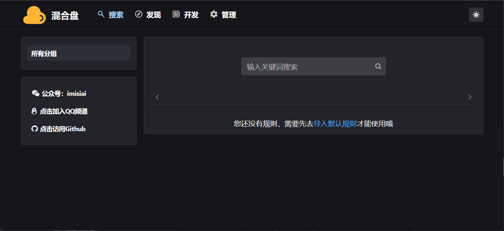
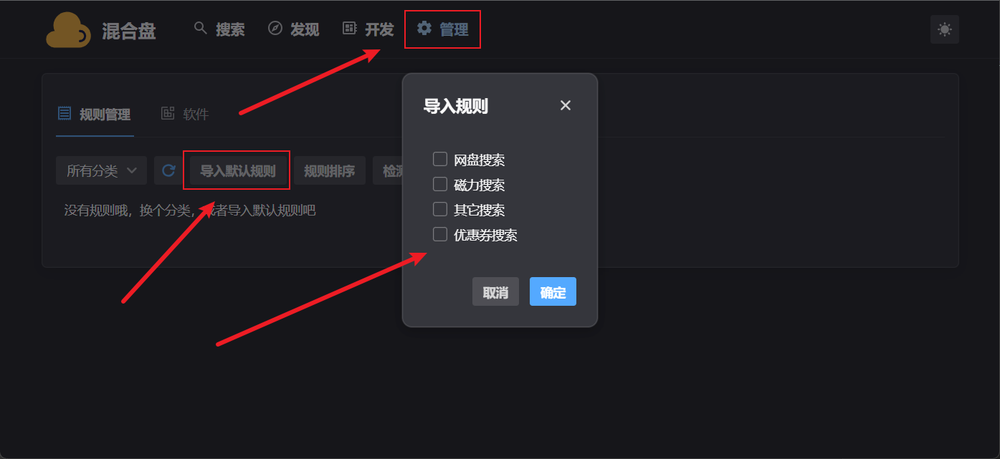
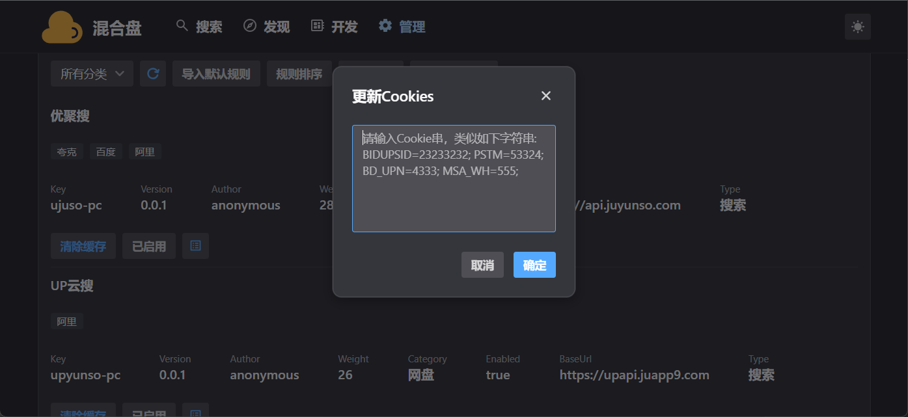

# 混合盘PC

**混合盘PC不是一个开源项目，至少目前不是！此仓库仅用来供用户下载、提isuue**

混合盘PC版本：混合盘PC是一个规则引擎，可以通过编写规则来实现全网资源的聚合搜索，包括但不限于网盘搜索、磁力搜索

混合盘PC基于Golang+React，所以可支持3大平台：Windows, Mac, Linux

## 教程

[https://mp.weixin.qq.com/s/ygJHt4KnINRc6A3GpL_qzQ](https://mp.weixin.qq.com/s/ygJHt4KnINRc6A3GpL_qzQ)

简单说一下，具体请看上面那篇公众号文章：

1. 下载自己对应平台的压缩包，解压；
2. 里面有start.sh（windows下是start.bat)，理论是会自动打开浏览器，然后根据提示导入默认规则即可；
3. 如果没有自动打开浏览器，则用Terminal（CMD)运行可以执行文件，根据Terminal中提示的地址，在浏览器中打开就行；

## 下载

https://wwhb.lanzouw.com/b038tvjef

https://www.123pan.com/s/zCHSVv-veYvd.html

https://pan.quark.cn/s/67ee4856c72e

## 预览

